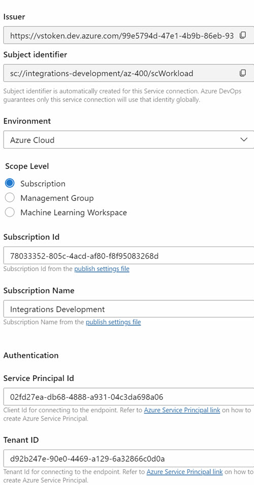

# Azure Devops Service Connections

## Links & Resources

[Workload Identity Federation](https://learn.microsoft.com/en-us/entra/workload-id/workload-identity-federation)

[Connect to Azure by using an Azure Resource Manager service connection](https://learn.microsoft.com/en-us/azure/devops/pipelines/library/connect-to-azure?view=azure-devops)

[Azure DevOps CLI service endpoint](https://learn.microsoft.com/en-us/azure/devops/cli/service-endpoint?view=azure-devops)

## Create a Workload Identity Service Connection

- Create a Workload Identity Service Connection manually in Azure DevOps.

    

- Use Script create-principal.ps1 to create the Service Principal.

    ```bash
    grp=az400-dev
    subscriptionId=78033352-805c-4acd-af80-f8f95083268d
    resourceGroupScope="/subscriptions/$subscriptionId/resourcegroups/$grp"
    identityName=scIdentityWorkload
    federatedCredentialName="AzureDevOps"
    audience="api://AzureADTokenExchange"
    issuerUrl="https://vstoken.dev.azure.com/99e5794d-47e1-4b9b-86eb-937aa20e4e11"
    subjectIdentifier="sc://integrations-development/az-400/scIdentityWorkload"
    contributorRoleId=b24988ac-6180-42a0-ab88-20f7382dd24c

    # Create a managed identity
    principalId=$(az identity create --name $identityName --resource-group $grp --query principalId -o tsv)

    # Get the client id
    clientId=$(az identity show --name $identityName --resource-group $grp --query clientId -o tsv)

    # Assign the managed identity the contributor role
    az role assignment create --assignee $principalId --role $contributorRoleId --scope $resourceGroupScope

    # Create a federated credential
    az identity federated-credential create --name $federatedCredentialName --identity-name $identityName --resource-group $grp --issuer $issuerUrl --subject $subjectIdentifier --audiences $audience
    ```    

    >Note: Copy Issuer and Subject Identifier from the Service Connection UI in Azure DevOps.    

    >Note: Service Principal Id is the client id of the Service Principal created.

    

- Adjust RBAC permissions on Resource Group as required. Role Ids are available [here](https://learn.microsoft.com/en-us/azure/role-based-access-control/built-in-roles)

## Use Workload identity in Azure DevOps

- Examine pipeline `catalog-ci-cd-workload-identity.yml`. It uses `scWorkload`

```yaml
variables:
  dotnetSdkVersion: "8.x"
  buildConfiguration: Release
  releaseBranchName: master
  azSubscription: scWorkload
  appPath: src/services/catalog-service/api/
  appService: food-catalog-api-yaml
```