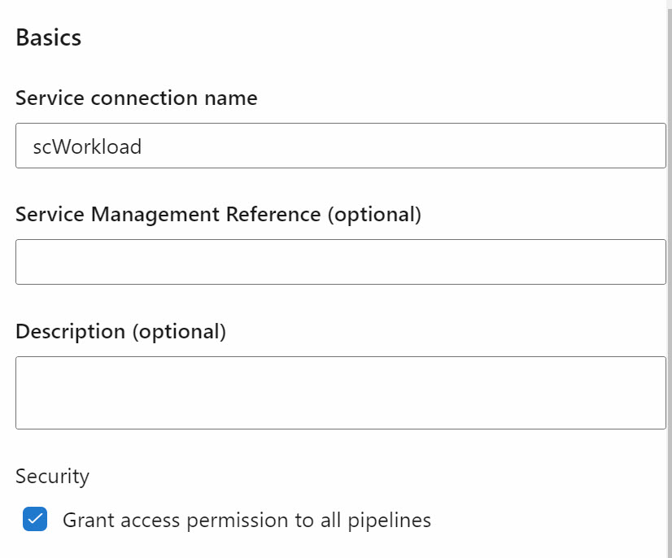
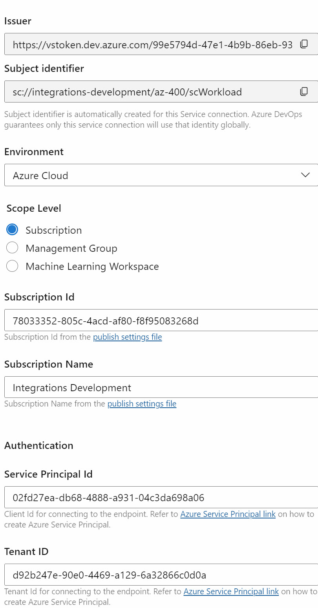

# Create a Workload Identity Service Connection

- Create a Workload Identity Service Connection manually in Azure DevOps.

    

- Use Script create-principal.ps1 to create the Service Principal.

    ```powershell
    $subscriptionId = "78033352-805c-4acd-af80-f8f95083268d"
    $resourceGroupName = "az400-dev"
    $resourceGroupScope = "/subscriptions/$($subscriptionId)/resourcegroups/$($resourceGroupName)"
    $identityName = "scWorkload"
    $federatedCredentialName = "AzureDevOps"
    $audience = "api://AzureADTokenExchange"
    $issuerUrl = "https://vstoken.dev.azure.com/99e5794d-47e1-4b9b-86eb-937aa20e4e11"
    $subjectIdentifier = "sc://integrations-development/az-400/scWorkload"

    $identity = az identity create --name $identityName --resource-group $resourceGroupName | ConvertFrom-Json

    Write-Host $identity

    $contributorRoleId = "b24988ac-6180-42a0-ab88-20f7382dd24c"
    az role assignment create --assignee $identity.principalId --role $contributorRoleId --scope $resourceGroupScope
    az identity federated-credential create --name $federatedCredentialName --identity-name $identityName --resource-group $resourceGroupName --issuer $issuerUrl --subject $subjectIdentifier --audiences $audience
    ```    

    >Note: Copy Issuer and Subject Identifier from the Service Connection UI in Azure DevOps.    

    >Note: Service Principal Id is the client id of the Service Principal created.

    

- Adjust RBAC permissions on Resource Group as required. Role Ids are available [here](https://learn.microsoft.com/en-us/azure/role-based-access-control/built-in-roles)