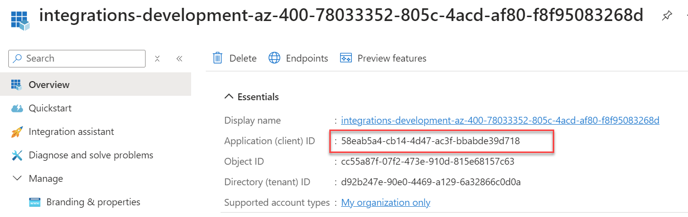
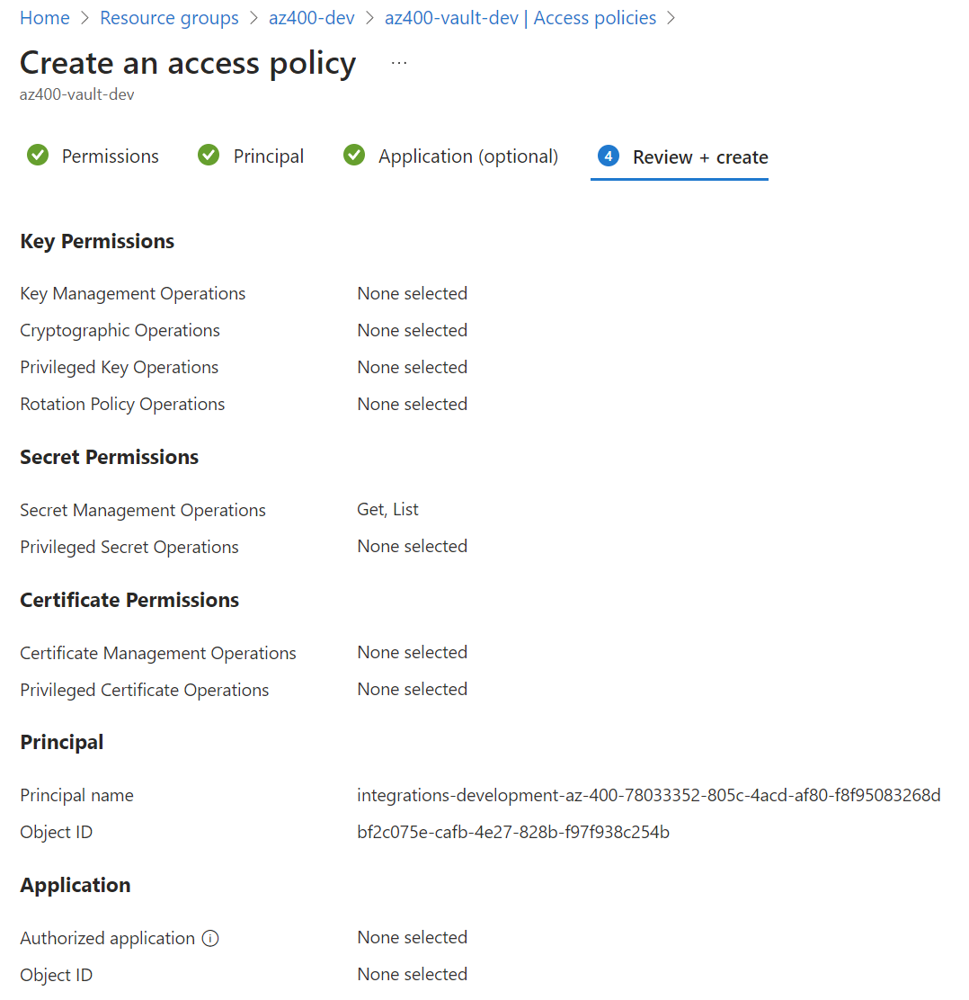

# Managed Identity & Key Vault

- Explain Managed Identity Basics in Short
- Explain and execute: `create-api-mi.azcli`
- Give a brief overview over `food-app/apps/catalog-api/api/appsettings.json`

## Demos

### Microsoft 365 SharePoint and Teams WebPart Deployment using Key Vault

- Create KeyVault using `create-vault.azcli`

- Assign Key Vault Permissions for Workload Identity

    

     

- Import pipeline [spfx-ci-cd-kv.yml](/deploy/pipelines/spfx-ci-cd-kv.yml)