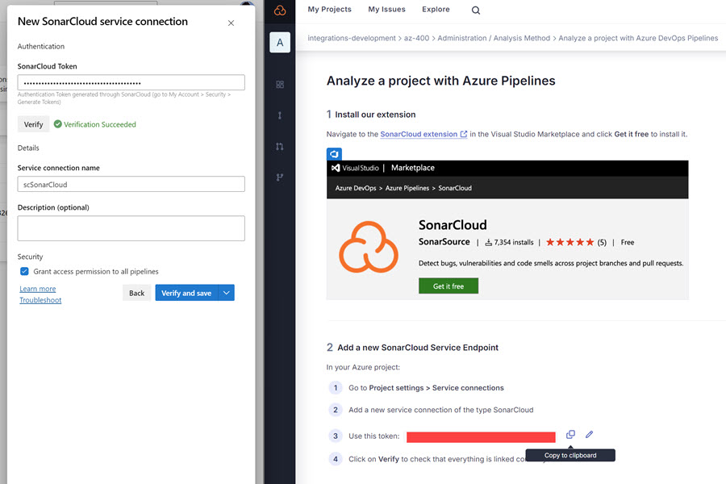

# Static Analysis using Sonar Cloud

## Links & Resources:

[Defender for DevOps](https://learn.microsoft.com/de-de/azure/defender-for-cloud/defender-for-devops-introduction?ocid=AID754288&wt.mc_id=azfr-c9-scottha%2CCFID0709)

[Overview of Microsoft Defender for Containers](https://learn.microsoft.com/en-us/azure/defender-for-cloud/defender-for-containers-introduction)

[Sonar Lint VS Code](https://marketplace.visualstudio.com/items?itemName=SonarSource.sonarlint-vscode)

## Demos

### Sonar Cloud

- Register [SonarCloud](https://sonarcloud.io) organization and project:

- Get Token for Service Connection:

    

- Execute `catalog-ci-sonar-cloud.yml` to start analysis

- Review the results in [SonarCloud Analysis](https://sonarcloud.io/summary/new_code?id=integrations-development_az-400&branch=main)   