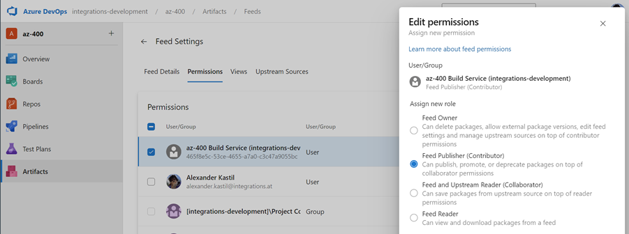

# Azure Artifacts

## Links & Resources

[Artifacts in Azure Pipelines](https://docs.microsoft.com/en-us/azure/devops/pipelines/artifacts/artifacts-overview?view=azure-devops&tabs=nuget)

[Azure Artifacts Credential Provider](https://github.com/microsoft/artifacts-credprovider#azure-artifacts-credential-provider)

[Azure Artifacts Upstream Sources](https://docs.microsoft.com/en-us/azure/devops/artifacts/concepts/upstream-sources?view=azure-devops)

[Azure Artifacts Credential Provider](https://github.com/microsoft/artifacts-credprovider?tab=readme-ov-file)

## Demo

- This demo uses [order-service](/src/services/order-service/) which references [food-app-common](/src/services/food-app-common/). 

- Explain Azure Artifacts

- Create a Feed `food-packages` in Azure Artifacts and assign permissions to the [PROJECT]\Build Service ([PROJECT] is the name of your Azure DevOps project)

    
- Run `food-app-common-ci-cd-artifacts.yml` to produce the common package

- Explain [Azure Artifacts Credential Provider](https://github.com/microsoft/artifacts-credprovider) and [Device Auth Flow](https://docs.microsoft.com/en-us/azure/active-directory/develop/v2-oauth2-device-code). The installation script can be downloaded [here](https://github.com/microsoft/artifacts-credprovider/blob/master/helpers/installcredprovider.ps1).

- The original `food-app-common` package was referenced in `order-service.csproj` using the following reference:

    ```xml
    <ItemGroup>
        <ProjectReference Include="..\food-app-common\food-app-common.csproj" />
    </ItemGroup>
    ```

- Replace it by using the package reference and remove the relative path reference:

    ```xml
    <ItemGroup>
        ...
        <PackageReference Include="food-app-common" Version="1.0.0" />
    </ItemGroup>

- Add a `nuget.config:`

    ```xml
    <?xml version="1.0" encoding="utf-8"?>
    <configuration>
    <packageSources>
        <clear />
        <add key="food-packages" value="https://pkgs.dev.azure.com/integrations-development/az-400/_packaging/food-packages/nuget/v3/index.json" />
    </packageSources>
    </configuration>
    ```

- Run `dotnet restore --interactive`

    

- Run `orders-ci.yml` to build the `order-service`

- Show Feed and upstream sources

    