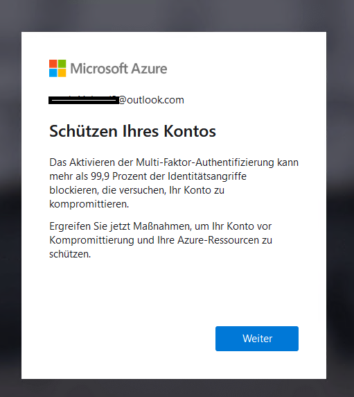

# Activate and use your Lab Host

## !!! Important !!! DO  NOT USE YOUR SCHOOL or WORK ACCOUNT FOR THIS PROCESS !!!
## !!! Important !!! DO  NOT USE AN ACCOUNT THAT YOU HAVE PREVIOUSLY USED TO CLAIM AN AZURE PASS !!!

Azure Passes can only be used once per [Microsoft Account](https://account.microsoft.com/Account). Please do not use Azure AD Accounts (Cooperate Accounts). Use the same e-mail account that you will use for the Azure DevOps Organization. If you are not sure, please register a new Microsoft Account:

- [Outlook.com](http://www.outlook.com/)      

## !!! DANGER ZONE !!! IF YOU DO NOT STICK TO THIS INSTRUCTIONS YOU MIGHT INVALIDATE YOR AZURE PASS VOUCHER !!!

Use your Azure Pass Code to create a subscription with free credits at [www.microsoftazurepass.com](https://www.microsoftazurepass.com/). To avoid proxy issues with your company network, please use the lab host that you have activated in the last step. 

>Note: You can check the balance of your Azure Pass Credits on https://www.microsoftazuresponsorships.com/balance

Click Start & Log In:

Confirm Account:

Enter Code:

Complete Profile:

Agree to Agreement:

Wait for Setup to complete:

Congratulations! You have claimed an Azure Pass for this training and activated your account on an Azure Subscription.

You do not have to setup MFA for this account. You can skip this step and close the popup.

