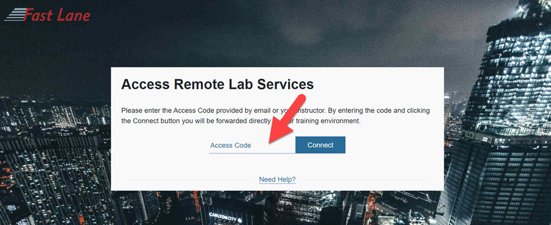
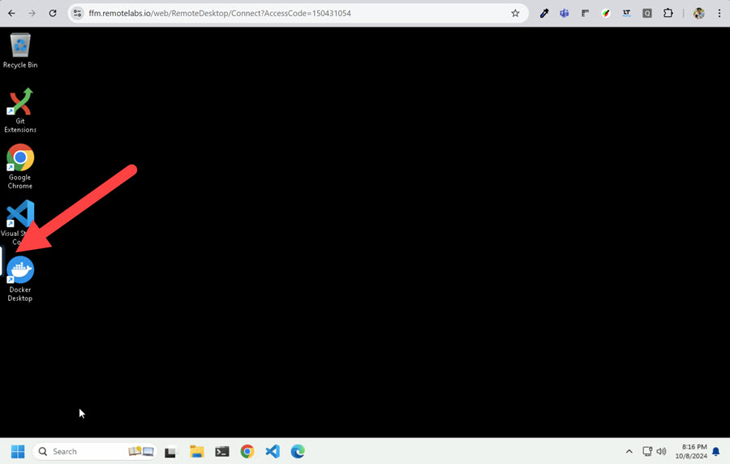
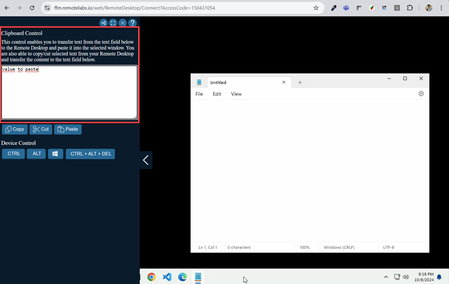
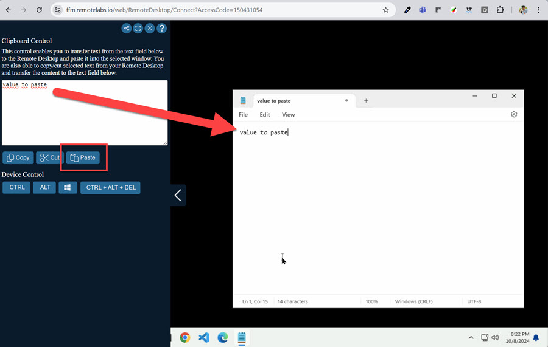

# Activate and use your Lab Host

- Navigate to [https://web-access.remotelabs.io
](https://web-access.remotelabs.io
) and enter the access code that has been provided to you.

    

- If you need to copy from your host to your lab host, hover over the sidebar on the left side.

    

- Activate the target in the lab host. Here we use notepad. Paste the content you want to copy into the `Clipboard Control`. In this case "value to paste". You can use `Ctrl + V` to paste the content into the clipboard.

        

- Use the Pase button to paste the content into the target.

    

- Values you would want to paste to the lab host are:

    - Azure Pass Vouchers
    - Git Repositories URLs
    - Lab Instructions URLs
    - ...