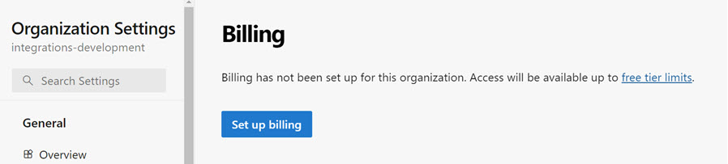
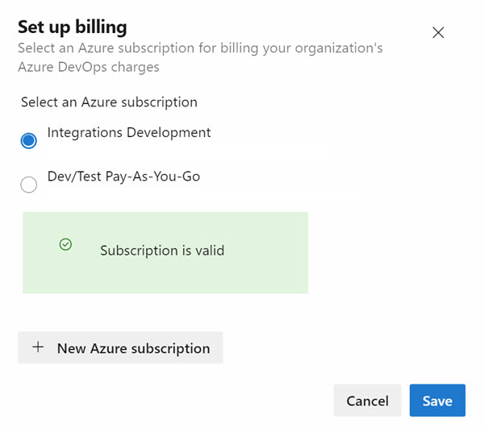
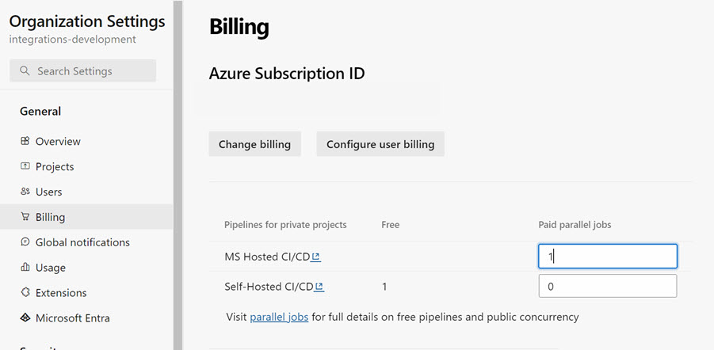

# Register Azure DevOps Organization

Go to [https://azure.microsoft.com/de-de/products/devops](https://azure.microsoft.com/de-de/products/devops) to register your Azure DevOps Organization

Create your DevOps organization. This will also the name of your first project:

## Use your Azure Credits to purchase Free Job Minutes for Microsoft Hosted Agents

- Go to your organization settings

- Go to `Parallel Jobs`. 

    

- Chose `Purchase parallel jobs`

- Set up billing.

    

- Choose your Azure Subscription and the amount of parallel jobs you want to purchase.    

    

- Setup 1 job

    

## Request your free 1.800 minutes of Microsoft Hosted Agents

Fill out the [request](https://aka.ms/azpipelines-parallelism-request) to get the grant for free agent build minutes:

You can check the grant at: `https://dev.azure.com/<DEVOPS-ORGA>/_settings/buildqueue?_a=concurrentJobs`